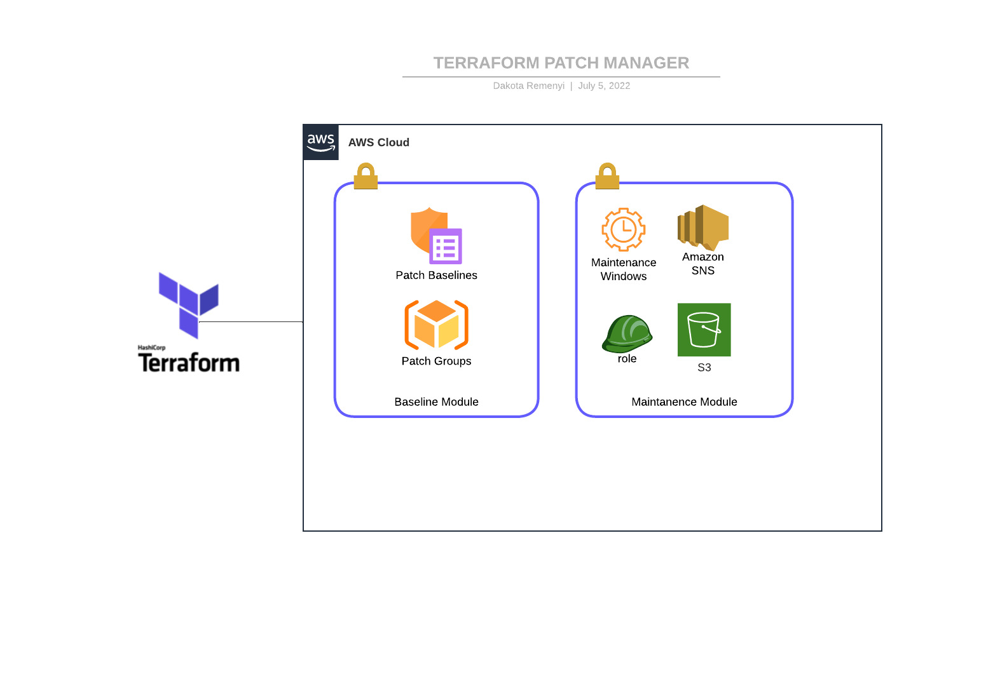

<div id="top"></div>

<!-- PROJECT LOGO -->
<br />
<div align="center">
  <a href="https://www.coalfire.com">
    
  </a>

<h3 align="center">Terraform Module for Patch Manager</h3>

  <p align="center">
    Automate your baselines, maintanence windows, and tasks for your chosen operating system.
    <br />
    <a href="#related-documentation"><strong>Explore the docs »</strong></a>
    <br />
    <br />
    <a href="https://github.com/github_organization/repo_name">View Demo</a>
    ·
    <a href="https://github.com/github_organization/repo_name/issues">Report Bug</a>
    ·
    <a href="https://github.com/github_organization/repo_name/issues">Request Feature</a>
  </p>
</div>


<!-- TABLE OF CONTENTS -->
<details>
  <summary>Table of Contents</summary>
  <ol>
    <li>
      <a href="#about-the-project">About The Project</a>
      <ul>
        <li><a href="#built-with">Built With</a></li>
      </ul>
    </li>
    <li>
      <a href="#getting-started">Getting Started</a>
      <ul>
        <li><a href="#prerequisites">Prerequisites</a></li>
        <li><a href="#installation">Installation</a></li>
        <li><a href="#module-defaults">Module Defaults</a></li>
        <li><a href="#common-defaults">Common Defaults</a></li>
        <li><a href="#defaults-specific-to-windows-baseline">Windows Server Defaults</a></li>
        <li><a href="#defaults-specific-to-redhat-enterprise-linux">Rhel Defaults</a></li>
      </ul>
    </li>
    <li><a href="#usage">Usage</a></li>
    <ul>
    <li> <a href="#configure-your-terraform-manifest">Complete Example</a></li>
    </ul>
    <li><a href="#roadmap">Roadmap</a></li>
    <li><a href="#license">License</a></li>
    <li><a href="#contact">Contact</a></li>
  </ol>
</details>


<!-- ABOUT THE PROJECT -->
## About The Project
This project allows for a quick creation of maintanence windows for SSM patching. 

### High Level Diagram



<br>

<p align="right">(<a href="#top">back to top</a>)</p>


### Built With


<p align="right">(<a href="#top">back to top</a>)</p>

## What Do These Modules Create?
    * A label for your resources that will be applied at the prefix of your resources for easy identification 
      - Prefix: (cf-ssm-pbl)
    
    * As many baselines as you need.
        - Naming Convention ${label}-${environment}-${operating_system-baseline)
        - Example (cf-ssm-pbl-dev-redhat_enterprise_linux-baseline)

    * A Maintanence window for patching tasks (scanning, installing OR both) that is define by your cron job specification. 
         - Naming Convention:${label}-${environment}-${operating_system}-patch-maintenance-${TYPE}-mw)    
         - Example:cf-ssm-pbl-dev-REDHAT_ENTERPRISE_LINUX-patch-maintenance-scan-mw
    * A Maintanence window task that is associated with the maintanence window above (scan, install, etc)

    * A Role and policy association for each patch group/baseline. 
        - Naming convention: ${label}-${env}-${operating_system}-patching-role"
        - Example: cf-ssm-pbl-dev-REDHAT_ENTERPRISE_LINUX-patching-role

    * S3 Bucket and ACL for logging
        - Naming convention: ${label}-${env}-patching-logs-bucket-[your unique identifier]
        - Example: cf-ssm-pbl-dev-patching-logs-bucket
    
    * SNS Topic for Notifications and role association
        - Naming convention: ${label}-${env}-${operating_system}-patching-notification
        - Example: cf-ssm-pbl-dev-REDHAT_ENTERPRISE_LINUX-patching-notification


<!-- GETTING STARTED -->
## Getting Started

To get started with this project locally, please read the next few steps carefully.

### Prerequisites

* Your instances must have the SSM agent installed on them to patch with this solution

* This solution assumes that you are using patch groups via the ["Patch Group"](https://docs.aws.amazon.com/systems-manager/latest/userguide/sysman-patch-group-tagging.html) tag. 

* terraform (for mac os)
    ```sh
    brew install terraform
    ```
* terraform (for windows and [chocolatey](https://chocolatey.org/))
    ```sh
    choco install terraform
    ```
* While an IDE is not required to run terraform it is STRONGLY recommended. Click to [download](https://code.visualstudio.com/) VSCode


### Installation

1. Upload an SSH key for your identity to the Coalfire Github
    * [Generating your first SSH key](https://www.ssh.com/academy/ssh/keygen)
    * [Adding a new SSH key to your GitHub account](https://docs.github.com/en/authentication/connecting-to-github-with-ssh/adding-a-new-ssh-key-to-your-github-account)
2. Clone the repo
   ```sh
   git clone ENTER COALFIRE GITHUB REPO .GIT LATER
   ```
3. Create new directories for module calls under TERRAFORM/main (ignore the .terraform folder in the screenshot) In my example, my client would like to split up the patch groups for windows and linux

    <br>

     
<br>

4. Create the environment sub directories. The goal is to keep the code easy to understand for anyone that may need to made changes. In this example, the dev windows servers will be patched by a patch group and prod will have their own. But it doesn't have to stop there. These could be seperated out by application. Another example could be exchange, domain controllers, frontend, etc

    <br>

    

    <br>

5. Create the required terraform configuration files. Click on each file name to see how this configuration should be structured.
    * Providers.tf
    * locals.tf
    * Outputs.tf
    * ["Name of your module here"].tf 
      * This is where you will call the modules. You can name this file anything you want as long as it ends in .tf
        * example: windows-dev-patching.tf

6. Configure your module with the required variables. 
    * Source your module with the correct location
        * Your location will vary based on your sub-directories in the TERRAFORM/main parent directory. The module is located in in the root under /patching/modules/
        An example of this from my dev folder in RHEL would look like
        ```sh
        source = "../../../../patching/modules/baselines/linux/rhel"
        ```
    * Configure your variables in the locals resource block. Please review the [required variables]() and the [optional variables](). Below, you will see some examples:
        * [RHEL]() with default module patch baseline.
        * [Windows]() with additional customization for patch baseline module.


<p align="right">(<a href="#top">back to top</a>)</p>


<!-- USAGE EXAMPLES -->
## Usage

### Module Defaults

By default the modules will create baselines and maintanence windows with default parameters. You may modify the behavior of the modules by using arguements in the top level locals resource block. There are defaults that are specific to the operating system baselines; however, there are defaults that each baseline share.

#### Common Defaults:

Role:
```sh

resource aws_iam_role ssm_maintenance_window_role 
  name = var.role_name
  path = /system/

  assume_role_policy = <<EOF
      SEE CODE
EOF


  aws_iam_role_policy_attachment role_attach_ssm_mw 
  role       = aws_iam_role.ssm_maintenance_window_role.name
  policy_arn = arn:aws:iam::aws:policy/service-role/AmazonSSMMaintenanceWindowRole

```
Bucket:

```sh

  aws_s3_bucket patch_log_bucket 
  bucket = local.bucket 
  tags = merge(MERGES DEFAULT TAGS AND NAME OF THE BUCKET)


  aws_s3_bucket_acl patch_bucket_acl 
  bucket = aws_s3_bucket.patch_log_bucket.id
  acl = private

```
SNS Topic:

```sh
    name = ${var.patch_baseline_label}-${var.env}-${local.operating_system}-patching-notification

```

#### Defaults Specific to Windows Baseline:

```sh
Approval Rules:
          approve_after_days  = 7
          compliance_level    = "UNSPECIFIED"
          enable_non_security = false
              patch_baseline_filters:

                name   = PRODUCT
                values = WindowsServer2016, WindowsServer2012R2
            
                name   = CLASSIFICATION
                values = CriticalUpdates, SecurityUpdates
            
                name   = MSRC_SEVERITY
                values = Critical, Important
          
Tags:
    terraform = "true"
    owner     = "coalfire"
    team      = "sre"

Compliance:
  default     = "UNSPECIFIED"

  
Null Values:
Approved patches
  type        = list(string)
  default     = []

Rejected Patches:
  type        = list(string)
  default     = []

```

#### Defaults Specific to RedHat Enterprise Linux

```sh
Approval Rules:
          approve_after_days  = 7
          compliance_level    = "UNSPECIFIED"
          enable_non_security = false
              patch_baseline_filters:

               ## All RedhatEnterpriseLinux versions are included in the default baseline. They are not listed in this read me for a cleaner look.

                name   = PRODUCT
                values = RedhatEnterpriseLinux
            
                name   = CLASSIFICATION
                values = Security
            
                name   = SEVERITY
                values = Critical
          
Tags:
    terraform = "true"
    owner     = "coalfire"
    team      = "sre"

Compliance:
  default     = "UNSPECIFIED"

  
Null Values:
Approved patches
  type        = list(string)
  default     = []

Rejected Patches:
  type        = list(string)
  default     = []

```


### DEFAULTS SPECIFIC TO OTHER OS'S
FOR DEFAULT VALUES SPECIFIC TO OTHER OS'S, PLEASE REVIEW THE MODULE UNDER:
```sh
patching/modules/baselines/*
```

### Required Local Variables
```sh

    compliance_level = high
    env = dev
    operating_system = module.rhel_baseline.operating_system
    scan_maintenance_window_schedule = cron(0 7/2 ? * * *)
    patch_groups = rhel

```

If you choose to ONLY use the required locals, then the module will assume that the default patch baseline filters in the module is acceptable for your baseline.


### Configure your terraform manifest

TO SEE EXAMPLES ON HOW TO CONFIGURE YOUR OWN TERRAFORM MANIFEST USING THESE MODULES, PLEASE SEE EXAMPLES IN:
```sh
aws-patch-manager/examples/
```


For more examples, please refer to the [Demo](PLACEHOLDER)


<p align="right">(<a href="#top">back to top</a>)</p>


<!-- RELATED DOCUMENTATION -->
## Related Documentation
* Click [here](https://coalfire.atlassian.net/wiki/spaces/~62b1e9325479e75d631c2a97/pages/1843625991/SSM+Patch+Manager+Automation) to review our internal Discovery and Design document
* Click [here](https://docs.aws.amazon.com/systems-manager/latest/userguide/systems-manager-patch.html) to read more on patching with SSM
* Click [here](https://coalfire.atlassian.net/wiki/spaces/CEHOME/pages/1840087095/Patching+Windows+Instances+with+AWS+Systems+Manager) to read Dave Stroms SSM patching guide
* Click [here](https://www.youtube.com/watch?v=ABtwRb9BFY4) to see an AWS demonstration of patching with Systems Manager
* Click [here](https://learn.hashicorp.com/tutorials/terraform/install-cli#install-terraform) to learn how to install Terraform

<!-- ROADMAP -->
## Roadmap

- [ ] Terraform Backend and State locking (s3 and dynamoDB)
- [ ] Unique S3 Bucket Names for Logging
- [ ] CI/CD Pipeline
    - [ ] CodeCommit, Code Deploy integration
    - [ ] Jinja and Python integration to automate parent module variable values

See the [open issues](https://github.com/github_organization/repo_name/issues) for a full list of proposed features (and known issues).

<p align="right">(<a href="#top">back to top</a>)</p>


<!-- LICENSE -->
## License

Distributed under the GNU License. Review the [LICENSE.txt](LICENSE) for more information.

<p align="right">(<a href="#top">back to top</a>)</p>


<!-- CONTACT -->
## Contact

* Dakota Remenyi - dakota.remenyi@coalfire.com
* Bradley Taylor - bradley.taylor@coalfire.com

<p align="right">(<a href="#top">back to top</a>)</p>